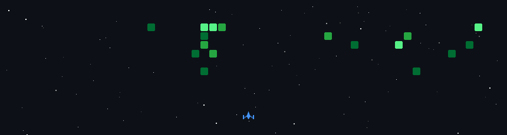

  <h1>
    
    Hi, I'm Vikas Singh
  </h1>

  

    
    &nbsp;
    
    &nbsp;
    
  

  

    
  

  

    
    &nbsp;
    
    &nbsp;
    
    &nbsp;
    
    &nbsp;
    
  

### 🛡️ About Me

> I am a **Cybersecurity Professional** specializing in **Web & Application Security**. Currently, I am actively expanding my expertise into **Cloud Security**, **DevSecOps**, and **IoT & Hardware Security** — focusing on practical vulnerability assessments, threat analysis, penetration testing, and architecting automated security pipelines with **n8n** and **Python**.

### 🛠️ Security Arsenal

 

#### 🔴 Web & Application Security (Offensive)
> *Penetration Testing, Vulnerability Research & Exploitation*

 

#### 🔵 Defensive Security & SOC Operations
> *SIEM Monitoring, Threat Hunting & Detection Engineering*

 

#### ☁️ Cloud Security & DevSecOps
> *Cloud Hardening, IAM & Continuous Security Auditing*

 

#### 🔌 IoT & Hardware Security
> *Microcontroller Auditing & Embedded Firmware Analysis*

 

#### ⚙️ Security Automation & Scripting
> *SOAR Workflows, Automated Scanners & Custom Tooling*

 

  

    

  

