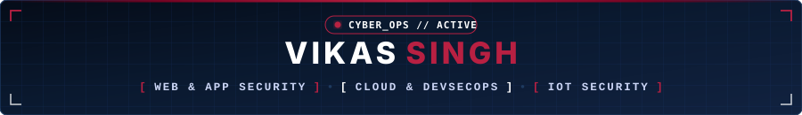

<!-- ═══════════════════════════════════════════════════════════════════════════════ -->
<!--                              HEADER                                         -->
<!-- ═══════════════════════════════════════════════════════════════════════════════ -->

  

  

    
  

  

    
    &nbsp;
    
    &nbsp;
    
    &nbsp;
    
    &nbsp;
    
  

---

### ⚡ About Me

- 🛡️ **Specialization**: SOC Operations, Threat Detection & Vulnerability Assessment
- 🎯 **Domain Focus**: Detection Engineering, Network Security & Penetration Testing
- ⚙️ **Workflow**: Automating incident response pipelines with **n8n** & **Python**
- 💬 **Ask me about**: SIEM detection rules (Sigma/YARA), Wireshark packet forensics, Splunk & Linux hardening

---

### 🛠️ Security Arsenal

| Focus Area | Technologies & Tools |
| :--- | :--- |
| 🔴 **Offensive Security** |                   |
| 🔵 **Defensive Security** |           |
| ☁️ **Cloud Security** |      |
| ⚙️ **Security Automation** |      |

---

### 📊 GitHub Activity

  

---

> *"Security is not a product, but a process."* — **Bruce Schneier**

