<!-- ═══════════════════════════════════════════════════════════════════════════════ -->
<!--                          HEADER / BANNER                                    -->
<!-- ═══════════════════════════════════════════════════════════════════════════════ -->

<div align="center">

  

</div>

<!-- ═══════════════════════════════════════════════════════════════════════════════ -->
<!--                          TYPING ANIMATION                                   -->
<!-- ═══════════════════════════════════════════════════════════════════════════════ -->

<div align="center">

  <a href="https://github.com/viikas-singhh">
    
  </a>

</div>

<br/>

<div align="center">

  

</div>

<br/>

---

<!-- ═══════════════════════════════════════════════════════════════════════════════ -->
<!--                             ABOUT ME                                        -->
<!-- ═══════════════════════════════════════════════════════════════════════════════ -->

## 🛡️ About Me

<table>
  <tr>
    <td>🔭</td>
    <td><b>Working on</b></td>
    <td>Cybersecurity projects, security labs, penetration testing and security automation</td>
  </tr>
  <tr>
    <td>🌱</td>
    <td><b>Learning</b></td>
    <td>Offensive Security, Defensive Security, Cloud Security and Security Research</td>
  </tr>
  <tr>
    <td>👯</td>
    <td><b>Collaborate on</b></td>
    <td>Cybersecurity and open-source security projects</td>
  </tr>
  <tr>
    <td>💬</td>
    <td><b>Ask me about</b></td>
    <td>Web Security, API Security, Network Security, SOC, SIEM, Pentesting and Security Tools</td>
  </tr>
</table>

<br/>

---

<!-- ═══════════════════════════════════════════════════════════════════════════════ -->
<!--                          OFFENSIVE SECURITY                                 -->
<!-- ═══════════════════════════════════════════════════════════════════════════════ -->

## 🔴 Offensive Security

<div align="center">

**Reconnaissance & Scanning**


**Exploitation & Post-Exploitation**


**Password Attacks**


**Active Directory & Network**


</div>

<br/>

---

<!-- ═══════════════════════════════════════════════════════════════════════════════ -->
<!--                          DEFENSIVE SECURITY                                 -->
<!-- ═══════════════════════════════════════════════════════════════════════════════ -->

## 🔵 Defensive Security

<div align="center">

**SIEM & Monitoring**


**Intrusion Detection & Threat Hunting**


**Endpoint Security**


</div>

<br/>

---

<!-- ═══════════════════════════════════════════════════════════════════════════════ -->
<!--                        SECURITY AUTOMATION                                  -->
<!-- ═══════════════════════════════════════════════════════════════════════════════ -->

## ⚙️ Security Automation

<div align="center">


</div>

<br/>

---

<!-- ═══════════════════════════════════════════════════════════════════════════════ -->
<!--                           CLOUD SECURITY                                    -->
<!-- ═══════════════════════════════════════════════════════════════════════════════ -->

## ☁️ Cloud Security

<div align="center">

**Cloud Platforms**


**Cloud Security Services**


**Microsoft Security**


</div>

<br/>

---

<!-- ═══════════════════════════════════════════════════════════════════════════════ -->
<!--                             LANGUAGES                                       -->
<!-- ═══════════════════════════════════════════════════════════════════════════════ -->

## 💻 Languages

<div align="center">


</div>

<br/>

---

<!-- ═══════════════════════════════════════════════════════════════════════════════ -->
<!--                          IOT & HARDWARE                                     -->
<!-- ═══════════════════════════════════════════════════════════════════════════════ -->

## 🔌 IoT & Hardware

<div align="center">


</div>

<br/>

---

<!-- ═══════════════════════════════════════════════════════════════════════════════ -->
<!--                           GITHUB STATS                                      -->
<!-- ═══════════════════════════════════════════════════════════════════════════════ -->

## 📊 GitHub Stats

<div align="center">

  <a href="https://github.com/viikas-singhh">
    
  </a>
  &nbsp;&nbsp;
  <a href="https://github.com/viikas-singhh">
    
  </a>

</div>

<br/>

<div align="center">

  <a href="https://github.com/viikas-singhh">
    
  </a>

</div>

<br/>

---

<!-- ═══════════════════════════════════════════════════════════════════════════════ -->
<!--                        SECURITY OPERATIONS                                  -->
<!-- ═══════════════════════════════════════════════════════════════════════════════ -->

## 💀 Security Operations

<div align="center">

  

</div>

<br/>

---

<!-- ═══════════════════════════════════════════════════════════════════════════════ -->
<!--                          CONNECT WITH ME                                    -->
<!-- ═══════════════════════════════════════════════════════════════════════════════ -->

## 🤝 Connect With Me

<div align="center">

  <!-- ⚠️ REPLACE PLACEHOLDER URLS BELOW WITH YOUR ACTUAL PROFILE LINKS ⚠️ -->

  <a href="https://github.com/viikas-singhh">
    
  </a>
  &nbsp;
  <a href="LINKEDIN_URL">
    
  </a>
  &nbsp;
  <a href="X_URL">
    
  </a>
  &nbsp;
  <a href="mailto:EMAIL">
    
  </a>

</div>

<br/>

---

<!-- ═══════════════════════════════════════════════════════════════════════════════ -->
<!--                        CYBERSECURITY QUOTE                                  -->
<!-- ═══════════════════════════════════════════════════════════════════════════════ -->

## 💭 Cybersecurity Quote

<div align="center">

```
┌──────────────────────────────────────────────────────────────────┐
│                                                                  │
│   "Security is not a product, but a process."                    │
│                                                                  │
│                                    — Bruce Schneier              │
│                                                                  │
└──────────────────────────────────────────────────────────────────┘
```

</div>

<br/>

<!-- ═══════════════════════════════════════════════════════════════════════════════ -->
<!--                              FOOTER                                         -->
<!-- ═══════════════════════════════════════════════════════════════════════════════ -->

<div align="center">

  

</div>
